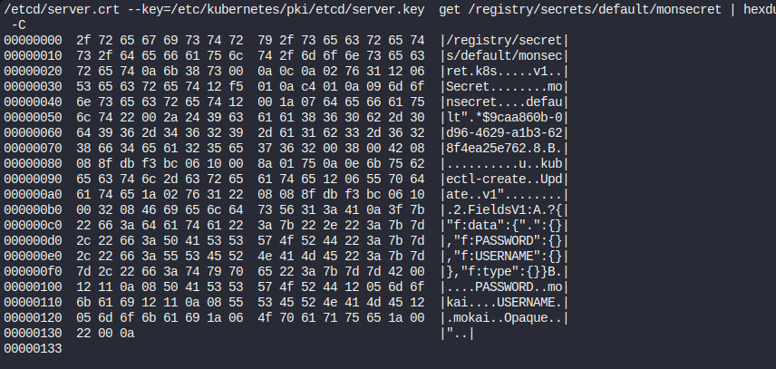
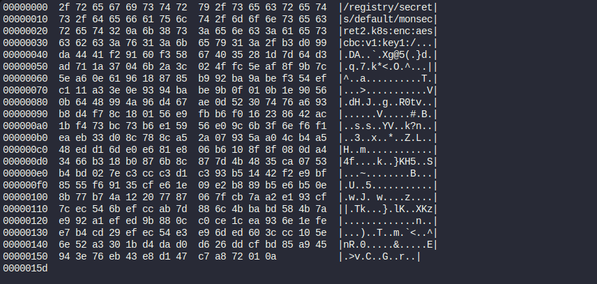

## Secret dans kubernetes
Dans kubernetes, les Secrets sont utilisés pur le stockage des données sensibles comme le password, les certificats etc.

```
  kubectl create secret generic monsecret --from-literal=USERNAME=mokai --from-literal=PASSWORD=mokai
```

## visualisation du secret dans l'ETCD

### installation de etcdctl

```
sudo apt-get update
```
```
sudo apt-get install etcd-client
```

### visualisation

```
ETCDCTL_API=3 etcdctl \
--cacert=/etc/kubernetes/pki/etcd/ca.crt   \
--cert=/etc/kubernetes/pki/etcd/server.crt \
--key=/etc/kubernetes/pki/etcd/server.key  \
get /registry/secrets/default/monsecret | hexdump -C
```
A la sortie, nous avons ce qui suit 




## Crypter le password pour qu'il ne soit pas visible dans l'etcd

Lien de la doc: https://kubernetes.io/docs/tasks/administer-cluster/encrypt-data/

- generation d'une clé
```
head -c 32 /dev/urandom | base64
```

Remplacer <BASE 64 ENCODED SECRET> par le retour de la commande ci-dessous

pl4fU9sOrUyPDrMDrMBcfAN5zKHPdFJxWuECDcEs7HU=

```
enc.yaml
```
```
apiVersion: apiserver.config.k8s.io/v1
kind: EncryptionConfiguration
resources:
  - resources:
      - secrets
      - configmaps
      - pandas.awesome.bears.example
    providers:
      - aescbc:
          keys:
            - name: key1
              # See the following text for more details about the secret value
              secret: pl4fU9sOrUyPDrMDrMBcfAN5zKHPdFJxWuECDcEs7HU=
      - identity: {} # this fallback allows reading unencrypted secrets;
                     # for example, during initial migration
```

Nous allons déplacer le fichier enc.yaml dans /etc/kubernetes/enc/
```
mkdir /etc/kubernetes/enc/
```
```
mv enc.yaml /etc/kubernetes/enc/
```
```
ls /etc/kubernetes/enc/
```

Ajouttons les configurations ci-dessous dans api-server

```
---
#
# This is a fragment of a manifest for a static Pod.
# Check whether this is correct for your cluster and for your API server.
#
apiVersion: v1
kind: Pod
metadata:
  annotations:
    kubeadm.kubernetes.io/kube-apiserver.advertise-address.endpoint: 10.20.30.40:443
  creationTimestamp: null
  labels:
    app.kubernetes.io/component: kube-apiserver
    tier: control-plane
  name: kube-apiserver
  namespace: kube-system
spec:
  containers:
  - command:
    - kube-apiserver
    ...
    - --encryption-provider-config=/etc/kubernetes/enc/enc.yaml  # add this line
    volumeMounts:
    ...
    - name: enc                           # add this line
      mountPath: /etc/kubernetes/enc      # add this line
      readOnly: true                      # add this line
    ...
  volumes:
  ...
  - name: enc                             # add this line
    hostPath:                             # add this line
      path: /etc/kubernetes/enc           # add this line
      type: DirectoryOrCreate             # add this line
  ...
```

Pour le faire:
```
nano /etc/kubernetes/manifests/kube-apiserver.yaml
```

1- dans les commandes du container ajoutons
```
- --encryption-provider-config=/etc/kubernetes/enc/enc.yaml
```
2- dans les volumes ajoutons
```
- name: enc                           # add this line
  hostPath:                           # add this line
    path: /etc/kubernetes/enc           # add this line
    type: DirectoryOrCreate             # add this line
```
3- dans les volumes mounts ajoutons

```
- name: enc                           # add this line
  mountPath: /etc/kubernetes/enc      # add this line
  readOnly: true                      # add this line
```

Conclusion: Puisqu'il s'agit d'un pod statique, après la sauvergarde des modifications, il redemmarre tout seul.

Pour vérifier s'il est déjà UP

```
kubectl get pod 
```

4- Si je crée un nouveau secret

```
  kubectl create secret generic monsecret2 --from-literal=USERNAME=mokai --from-literal=PASSWORD=mokai
```

En inspectant monsecret2 il sera crypté dans l'ETCD.

```
ETCDCTL_API=3 etcdctl \
--cacert=/etc/kubernetes/pki/etcd/ca.crt   \
--cert=/etc/kubernetes/pki/etcd/server.crt \
--key=/etc/kubernetes/pki/etcd/server.key  \
get /registry/secrets/default/monsecret2 | hexdump -C
```
A la sortie, nous avons ce qui suit 



Remarque!: Les secret qui existaient avant l'application de l'encryption ne sont pas crypté

### Essayon de monter le secret crypté dans l'etcd dans un pod

```
monpod_secret.yaml
```

```
apiVersion: v1
kind: Pod
metadata:
  name: monpod
  labels:
    name: demopod
    app: front-end
spec:
   containers:
   - name: demopod
     image: nginx
     ports:
       - containerPort: 80
     envFrom:
       - secretRef:
           name: monsecret2
```

```
kubectl apply -f monpod_secret.yaml
```

### Pour lister les variables d'environnement dans le pod
```
kubectl exec -ti monpod -- env
```