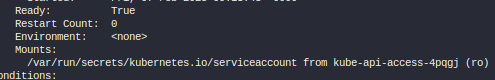

## Dans ce chapitre, nous entrons dans la sécurité sur kubernetes
On distingue les UserAccount et les ServiceAccount

## UserAccount

Les userAccount sont utilisé par l'administrateur du cluster kubernetes ou alors par les développeurs pour faire des deployment dans le cluster kubernetes.

## ServiceAccount

Son utilisé par des applications pour interagir avec le cluster Kubernetes (Jenkins, Prometheus, ...)

### Comment créer un serviceAccount

```
kubectl create serviceaccount dashboard-sa
```
Pour lister les serviceaccount disponnibles

```
kubectl get serviceaccount
```
Une fois le service account crée, il crée automatiquement le service account token qui sera utilisé par l'application pour s'authentifier auprès du cluster kubernetes.

```
kubectl describe serviceaccount dashboard-sa
```

Pour visualiser le token

```
kubectl describe secret dashboard-sa-token-bbaa
```

Le service Account peut être ajouté à la définition d'un Pod come suit:

```
apiVersion: v1
kind: Pod
metadata:
  name: monpod
  labels:
    name: demopod
    app: front-end
spec:
   containers:
   - name: demopod
     image: nginx
     ports:
       - containerPort: 80
   serviceAccountName: dashboard-sa
```

- NB: pour ajouter un serviceAccount a un pod existant, il faut le detruire et le recréer c'est pas forcement le cas pour les déployment.

Par defaut, chaque pod crée dans kubernetes utilise le service account token par defaut de kubernetes

```
kubectl run monpod --image=nginx
kubectl describe pod monpod
```

