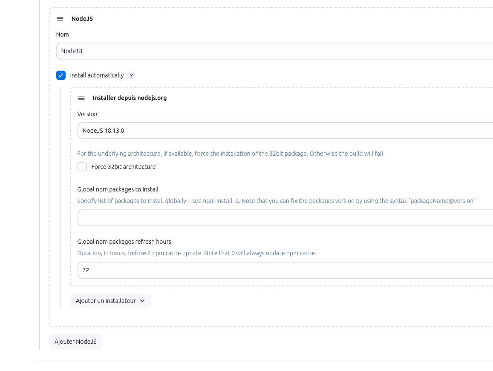

## Installation Jenkins


```
###############################################################################
#########################  JENKINS DEV      ###################################
###############################################################################
```


docker-compose.yml

```
services:
  jenkins:
    image: jenkins/jenkins:lts
    container_name: jenkins
    ports:
      - "8092:8080"
      - "50000:50000"
    volumes:
      - jenkins_home:/var/jenkins_home
    networks:
      - devops_network_app
      - devops_network_lab
    restart: unless-stopped
networks:
  devops_network_app:
    driver: bridge
  devops_network_lab:
    driver: bridge
volumes:
  jenkins_home:
    driver: local
```

## Installation Jenkins integrant maven

```
services:
  jenkins:
    image: jenkins/jenkins:lts
    container_name: jenkins
    ports:
      - "8092:8080"
      - "50000:50000"
    volumes:
      - jenkins_home:/var/jenkins_home
      - maven_repo:/var/jenkins_home/.m2
      - /var/run/docker.sock:/var/run/docker.sock  # Monter le socket Docker de l'hôte
    networks:
      - devops_network_app
      - devops_network_lab
    restart: unless-stopped
    user: root  # Required for package installations inside the container
    environment:
      MAVEN_HOME: /usr/share/maven
      JAVA_HOME: /usr/lib/jvm/java-17-openjdk-amd64  # Chemin du JDK 17
      PATH: $PATH:/usr/share/maven/bin:/usr/lib/jvm/java-17-openjdk-amd64/bin  # Ajout de Java au PATH
    command: >
      /bin/bash -c "
      apt-get update &&
      apt-get install -y maven docker.io openjdk-17-jdk wget yq &&
      wget https://github.com/aquasecurity/trivy/releases/download/v0.44.0/trivy_0.44.0_Linux-64bit.deb &&
      dpkg -i trivy_0.44.0_Linux-64bit.deb &&
      curl -L -o cosign https://github.com/sigstore/cosign/releases/latest/download/cosign-linux-amd64 &&
      mv cosign /usr/local/bin/cosign &&
      chmod +x /usr/local/bin/cosign &&
      exec /usr/local/bin/jenkins.sh"
networks:
  devops_network_app:
    driver: bridge
  devops_network_lab:
    driver: bridge
volumes:
  jenkins_home:
    driver: local
  maven_repo:
    driver: local
```

### pour lancer Jenkins

```
docker compose up -d
```

### confirmon l'installation de cosign

```
docker exec -it jenkins cosign version
```

### placer le fichier cosign.key dans le volume jenkins_jenkins_home

```
ls /var/lib/docker/volumes/jenkins_jenkins_home/_data
cd /var/lib/docker/volumes/jenkins_jenkins_home/_data
mkdir cosign
nano cosign.key
```
Copier le contenu du fichier

### pour avoir le password admin

```
docker exec jenkins cat /var/jenkins_home/secrets/initialAdminPassword
```
## default password

```
a8ab95b2b65a425690a91e3d0fd58c8e
```

### access url 

http://92.242.187.138:8092/

## change password
```
username: 
password: 
```

## installation des plugins

```
Pipeline Stage View Plugin
```


## installation pour un environnement de prod

```
###############################################################################
#########################  JENKINS PROD      ##################################
###############################################################################
```

### 📁 Arborescence

Commande pour la récupération des certificats sur cahque serveur

```
echo -n | openssl s_client -connect 10.145.40.242:8443 -servername 10.145.40.242 | \
sed -ne '/-BEGIN CERTIFICATE-/,/-END CERTIFICATE-/p' > nexus.crt
```

```
jenkins-reverse-proxy/
├── docker-compose.yml
|--- certs/
|   |___ sonarqube.crt
|   |___ nexus.crt
├── nginx/
│   ├── nginx.conf
│   ├── ssl/
│   │   ├── cert.pem
│   │   └── key.pem
```

### 1. 🔐 Génère ou place ton certificat SSL

```
mkdir -p nginx/ssl
openssl req -x509 -nodes -days 89365 -newkey rsa:2048 \
  -keyout nginx/ssl/key.pem \
  -out nginx/ssl/cert.pem \
  -subj "/CN=10.145.40.242"
```

### 2. ⚙️ Fichier nginx.conf

```
events {}

http {
  server {
    listen 443 ssl;
    server_name jenkins.local;

    ssl_certificate /etc/nginx/ssl/cert.pem;
    ssl_certificate_key /etc/nginx/ssl/key.pem;

    ssl_protocols TLSv1.2 TLSv1.3;

    location / {
      proxy_pass http://jenkins:8080;
      proxy_set_header Host $host;
      proxy_set_header X-Real-IP $remote_addr;
      proxy_set_header X-Forwarded-For $proxy_add_x_forwarded_for;
      proxy_set_header X-Forwarded-Proto https;
    }
  }
}

```

### 3. 🐳 Fichier docker-compose.yml

docker-compose.yml

```
services:
  jenkins:
    image: jenkins/jenkins:lts
    container_name: jenkins
    ports:
      - "8080:8080"  # HTTP interne, pas exposé publiquement
      - "50000:50000"
    volumes:
      - jenkins_home:/var/jenkins_home
      - maven_repo:/var/jenkins_home/.m2
      - /var/run/docker.sock:/var/run/docker.sock
      - ./certs/sonarqube.crt:/usr/local/share/ca-certificates/sonarqube.crt:ro
      - ./certs/nexus.crt:/usr/local/share/ca-certificates/nexus.crt:ro
    networks:
      - devops_network_lab
      - devops_network_app
    restart: unless-stopped
    user: root
    environment:
      MAVEN_HOME: /usr/share/maven
      JAVA_HOME: /usr/lib/jvm/java-17-openjdk-amd64
      PATH: "${PATH}:/usr/share/maven/bin:/usr/lib/jvm/java-17-openjdk-amd64/bin"
      JAVA_OPTS: "-Dorg.jenkinsci.plugins.durabletask.BourneShellScript.HEARTBEAT_CHECK_INTERVAL=86400"
    command: |
      /bin/bash -c "
      apt-get update &&
      apt-get install -y maven docker.io openjdk-17-jdk wget yq &&
      
      # Mise à jour des certificats système (ajout du certificat)
      update-ca-certificates &&
      # Import explicite dans le keystore Java
      
      keytool -importcert -trustcacerts -alias sonarqube -file /usr/local/share/ca-certificates/sonarqube.crt -keystore $JAVA_HOME/lib/security/cacerts -storepass changeit -noprompt ||
      echo 'Certificat sonarqube déjà importé ou erreur ignorée' &&
      
      keytool -import -trustcacerts -alias nexus-cert -file /usr/local/share/ca-certificates/nexus.crt -keystore $JAVA_HOME/lib/security/cacerts -storepass changeit -noprompt ||
      echo 'Certificat nexus déjà importé ou erreur ignorée' &&
      
      wget https://github.com/aquasecurity/trivy/releases/download/v0.44.0/trivy_0.44.0_Linux-64bit.deb &&
      dpkg -i trivy_0.44.0_Linux-64bit.deb &&
      curl -L -o cosign https://github.com/sigstore/cosign/releases/latest/download/cosign-linux-amd64 &&
      mv cosign /usr/local/bin/cosign &&
      chmod +x /usr/local/bin/cosign &&
      git config --global http.sslVerify false &&
      echo 'Git SSL verification disabled' &&
      exec /usr/local/bin/jenkins.sh"

  nginx:
    image: nginx:alpine
    container_name: nginx-jenkins
    ports:
      - "6443:443"
    volumes:
      - ./nginx/nginx.conf:/etc/nginx/nginx.conf:ro
      - ./nginx/ssl:/etc/nginx/ssl:ro
    depends_on:
      - jenkins
    networks:
      - devops_network_lab
    restart: unless-stopped

networks:
  devops_network_lab:
    driver: bridge
  devops_network_app:
    driver: bridge
    

volumes:
  jenkins_home:
    driver: local
  maven_repo:
    driver: local
  
```
### pour lancer Jenkins

```
docker compose up -d
```

```
curl -k https://10.145.40.242:6443
https://10.145.40.242:6443
```

### pour avoir le password admin

```
docker exec jenkins cat /var/jenkins_home/secrets/initialAdminPassword
```
## default password

```
a8ab95b2b65a425690a91e3d0fd58c8e
```

### access url

https://10.145.40.242:6443/

## change password
```
username: 
password: 
```

## Installation des plugins

```
blue ocean, 
maven, 
java jdk, 
git, 
pipeline, 
rbac stratégies, 
metrics, 
cloudbees, 
CloudBees Disk Usage Simple,
CloudBees Credentials,
ssh,
docker pipeline, 
jacoco,
coverage,
Pipeline Maven Integration,
Maven integration, 
Pipeline Utility Steps
SonarQube Scanner
SonarQube Quality Gates Plugin
NodeJS Plugin pour angular
```

# JENKINS UP AND TABLE

Pour le mode prod en https

Option 1: desactiver la vérification ssl par git dans le container jenkins

```
docker exec -it jenkins /bin/bash
git config --global http.sslVerify false
git config --global --get http.sslVerify

```

## pour vérifier si le certificat est bien present


```
docker exec -ti jenkins /bin/bash
keytool -list -keystore $JAVA_HOME/lib/security/cacerts -storepass changeit -alias nexus-cert
exit
docker restart jenkins
```

### pour nodeJs apres installation du plugins


