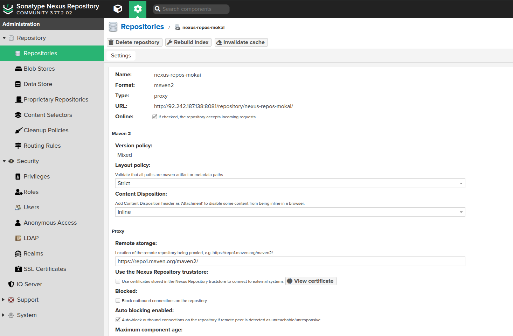
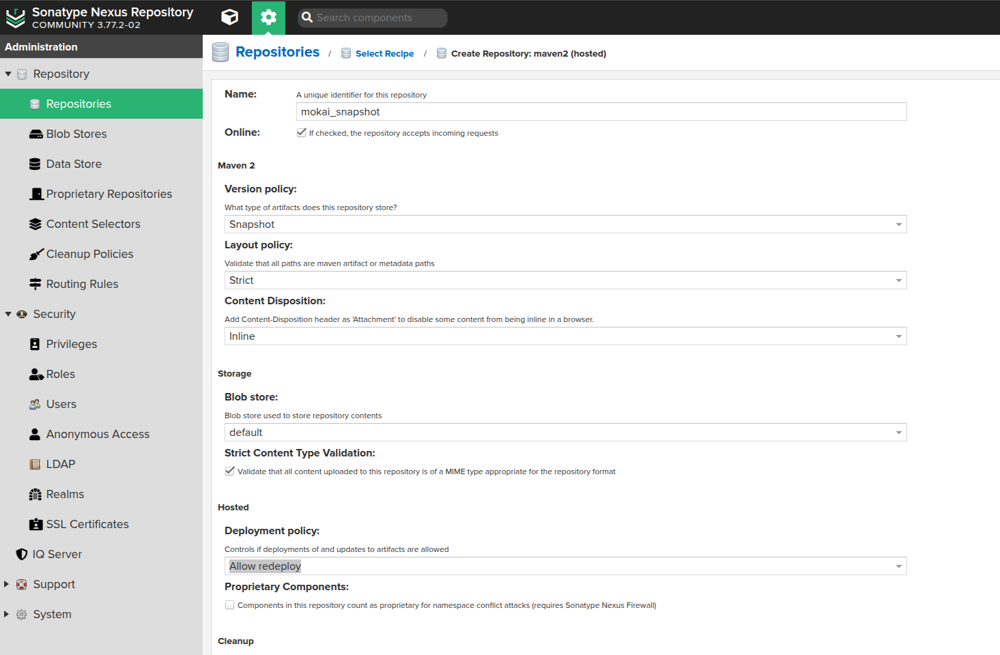
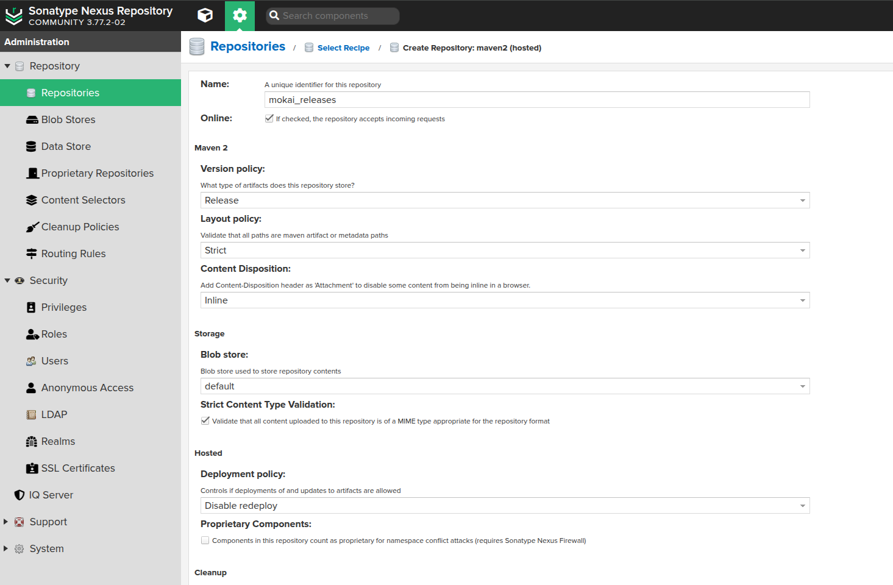

## configuration de nexus.

### 1- creation d'un repository maven2 de type proxy

NB: Les repos de type proxy sert de cache pour les artifact utiliser dans notre projet et si une dépendance n'est pas trouvé 
dans ce repos, nexus le recherche sur internet et le stocque pour les prochains utilisateurs.



### 2- creation d'un repository maven2 de type hosted pour les artifacts de type snapshot produits par nos équipes

NB: Les repos de types snapshot servent à garder nos artifact de type snapshot et nous pouvons les stocker dans ce type de repos à plusieurs reprise les artifacts ayant la même version.
(Allow redeploy)



### 3- creation d'un repository maven2 de type hosted pour les artifacts de type release produits par nos équipes.

NB: Les repos de types release servent à garder nos artifact de type release et nous pouvons les stocker dans ce type de repos à une seul reprise les artifacts ayant la même version.
(Disable redeploy)




## Java Config

### setting.xml

```
<?xml version="1.0" encoding="UTF-8"?>

<settings xmlns="http://maven.apache.org/SETTINGS/1.2.0"
          xmlns:xsi="http://www.w3.org/2001/XMLSchema-instance"
          xsi:schemaLocation="http://maven.apache.org/SETTINGS/1.2.0 https://maven.apache.org/xsd/settings-1.2.0.xsd">

     <servers>
        <server> 
            <id>nexus</id>
            <username>NEXUS_USENAME</username> 
            <password>NEXUS_PASSWORD</password> 
        </server>
     </servers>
     
     <mirrors>
           <!--<mirror>
              <id>central</id>
              <mirrorOf>central</mirrorOf>
              <name>Maven Central Mirror</name>
              <url>https://repo.maven.apache.org/maven2</url>
              <blocked>false</blocked>
          </mirror>
          <mirror>
               <id>maven-default-http-blocker</id>
               <mirrorOf>dummy</mirrorOf>
               <name>Dummy mirror to override default blocking mirror that blocks http</name>
               <url>http://0.0.0.0/</url>
         </mirror>-->
         
        
        <mirror>
          <id>nexus</id>
          <mirrorOf>*</mirrorOf> <!-- <== redirige toutes les requêtes vers Nexus -->
          <name>Nexus Mirror</name>
          <url>http://92.242.187.138:8081/repository/nexus-repos-mokai/</url>
        </mirror>

    </mirrors>


    <pluginGroups>
        <pluginGroup>org.sonarsource.scanner.maven</pluginGroup>
    </pluginGroups>
     
    <profiles>
        <profile>
            <id>nexus</id>
            <repositories>
                <repository>
                    <id>central</id>
                    <url>http://92.242.187.138:8081/repository/nexus-repos-mokai/</url>
                    <releases>
                        <enabled>true</enabled>
                    </releases>
                    <snapshots>
                        <enabled>true</enabled>
                    </snapshots>
                </repository>
            </repositories>
            <pluginRepositories>
                <pluginRepository>
                    <id>central</id>
                    <url>http://92.242.187.138:8081/repository/nexus-repos-mokai/</url>
                    <releases>
                        <enabled>true</enabled>
                    </releases>
                    <snapshots>
                        <enabled>true</enabled>
                    </snapshots>
                </pluginRepository>
            </pluginRepositories>
        </profile>
    </profiles>
    <activeProfiles>
      <activeProfile>nexus</activeProfile>
    </activeProfiles>
</settings>
```

## dans le pom.xml

```
<distributionManagement>
    <repository>
      <id>nexus</id>
      <name>Releases</name>
      <url>http://92.242.187.138:8081/repository/mokai_releases/</url>
    </repository>
    <snapshotRepository>
      <id>nexus</id>
      <name>Snapshot</name>
      <url>http://92.242.187.138:8081/repository/mokai_snapshot/</url>
    </snapshotRepository>
</distributionManagement>

<groupId>com.crm</groupId>
<artifactId>ms1</artifactId>
<version>0.0.1-SNAPSHOT</version>
<name>ms1</name>
<description>Demo project for Spring Boot</description>
```

## pour tester nos repos

``` bash
  mvn package clean
```

Avec cette commande maven ira chercher toutes les dependances en ligne et les gardera en cache dans nexus.

``` bash
  mvn deploy
```

Cette commande poussera notre artifact produit sur nexus.

## FIN  DU DOCUMENT
