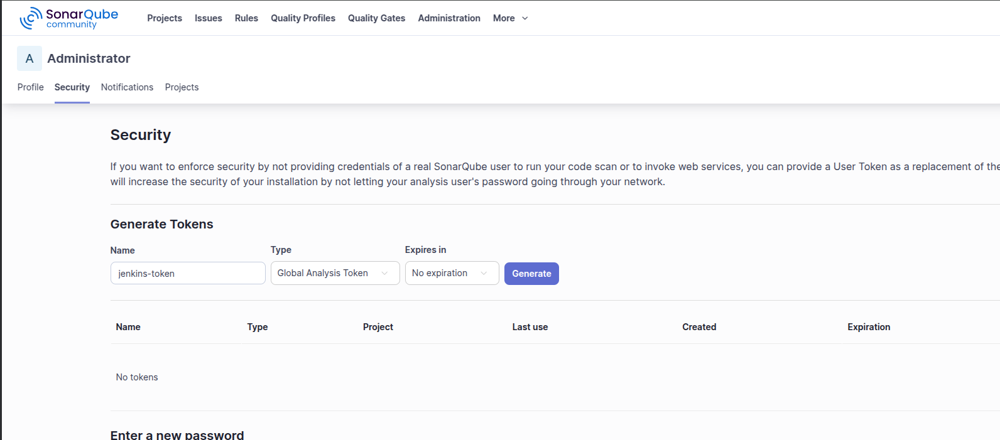
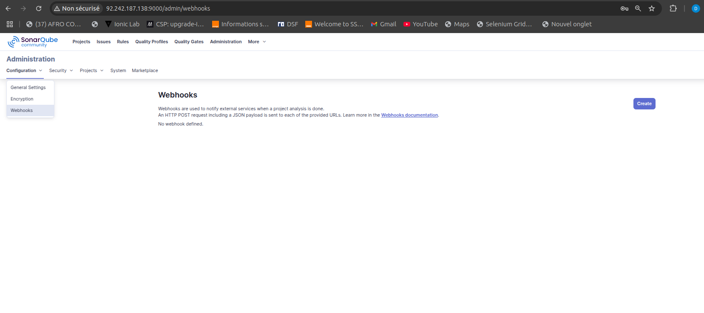
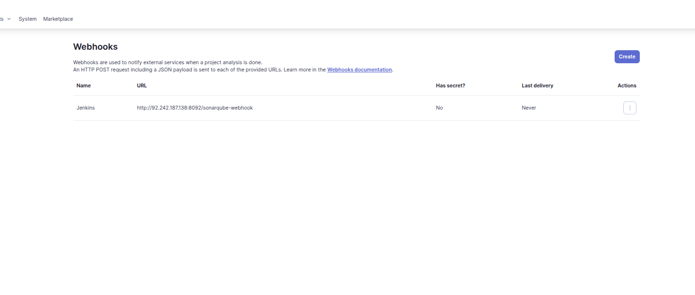
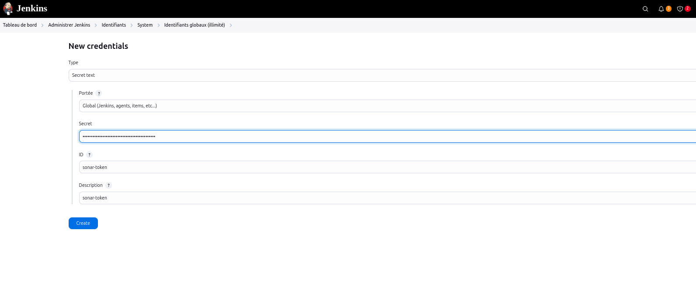
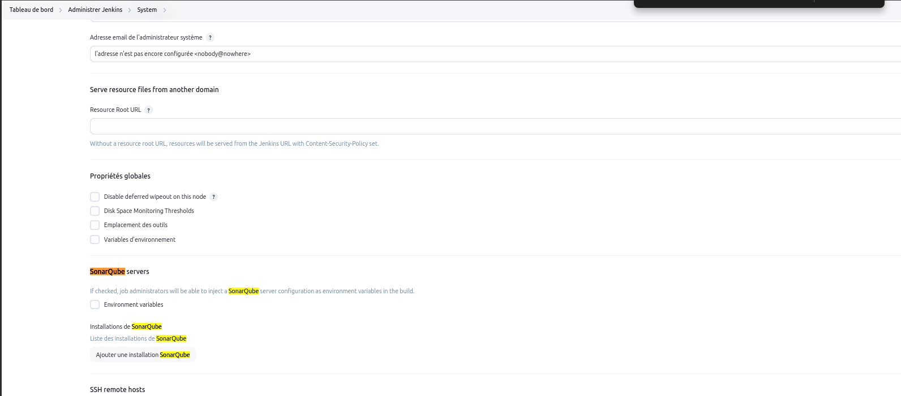
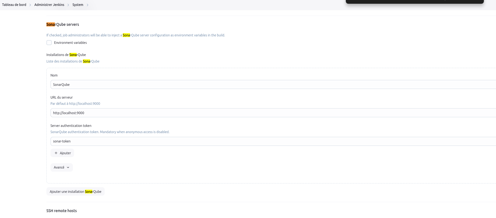

## Installation Configuration

### 1. 🔑 Créer un Token d’accès

Aller dans SonarQube > Mon compte > Security > Generate Token

Garde le token pour l'étape Jenkins.

#### 1.1 pour une communication bidirectionnel entre Snarqube et jenkins

NB: pour que SonarQube partage le resultat de l'analyse avec Jenkins il faut créer un webhooks dans sonarquebe

### 2. 🧰 Configurer sonarQube dans Jenkins

#### a) Installer le plugin SonarQube Scanner
Jenkins > Gérer Jenkins > Gérer les plugins > Installer SonarQube Scanner

### Creer les credential dans jenkins pour sonarQube

NB: Le type de credential est bien Secret text

#### b) Ajouter SonarQube dans Jenkins

Jenkins >Administrer Jenkins > System

Section SonarQube servers :

Nom : SonarQube

URL : http://localhost:9000

Ajouter les credentials (Token créé plus haut)

## FIN DU DOCUMENT