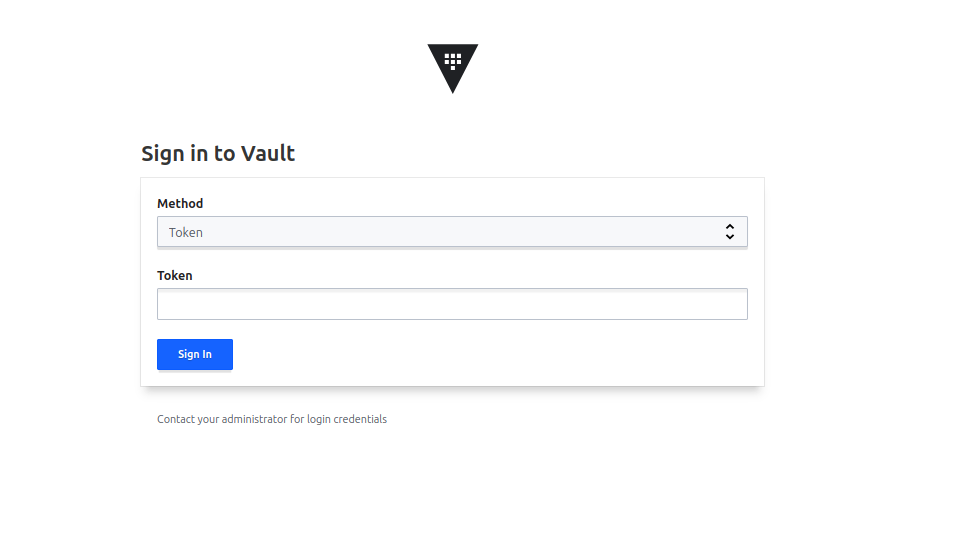
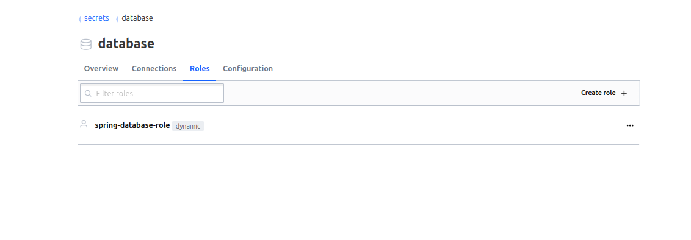

# Hvault et rotation de credential avec Java

### Lien de téléchargement de Hvault

https://developer.hashicorp.com/vault/install

### mise à jours des repos
```
wget -O- https://apt.releases.hashicorp.com/gpg | sudo gpg --dearmor -o /usr/share/keyrings/hashicorp-archive-keyring.gpg
echo "deb [signed-by=/usr/share/keyrings/hashicorp-archive-keyring.gpg] https://apt.releases.hashicorp.com $(lsb_release -cs) main" | sudo tee /etc/apt/sources.list.d/hashicorp.list
```
### installation de hvault
Intallation
```
sudo apt update && sudo apt install vault
```
Vérification du status
```
sudo systemctl status vault
```
arret de hvault
```
sudo systemctl stop vault
```
démarage de hvault
```
sudo systemctl start vault
```
redémarrage de hvault
```
sudo systemctl restart vault
```
### configuration de hvault pour la desactivation du ssl

Dans le fichier /etc/vault.d/vault.hcl nous allons modifier en commentant le bloc HTTPS Listener

```
# HTTPS listener
#listener "tcp" {
#  address       = "0.0.0.0:8200"
#  tls_cert_file = "/opt/vault/tls/tls.crt"
#  tls_key_file  = "/opt/vault/tls/tls.key"
#}

```

Le fichier final ressemblera a quelque chose comme ceci:


```
# Copyright (c) HashiCorp, Inc.
# SPDX-License-Identifier: BUSL-1.1

# Full configuration options can be found at https://developer.hashicorp.com/vault/docs/configuration

ui = true

#mlock = true
#disable_mlock = true

storage "file" {
  path = "/opt/vault/data"
}

#storage "consul" {
#  address = "127.0.0.1:8500"
#  path    = "vault"
#}

# HTTP listener
listener "tcp" {
  address = "127.0.0.1:8200"
  tls_disable = 1
}

# HTTPS listener
#listener "tcp" {
#  address       = "0.0.0.0:8200"
#  tls_cert_file = "/opt/vault/tls/tls.crt"
#  tls_key_file  = "/opt/vault/tls/tls.key"
#}

# Enterprise license_path
# This will be required for enterprise as of v1.8
#license_path = "/etc/vault.d/vault.hclic"

# Example AWS KMS auto unseal
#seal "awskms" {
#  region = "us-east-1"
#  kms_key_id = "REPLACE-ME"
#}

# Example HSM auto unseal
#seal "pkcs11" {
#  lib            = "/usr/vault/lib/libCryptoki2_64.so"
#  slot           = "0"
#  pin            = "AAAA-BBBB-CCCC-DDDD"
#  key_label      = "vault-hsm-key"
#  hmac_key_label = "vault-hsm-hmac-key"
#}

```

## Forcer vault a fonctionner en mode http

```
export VAULT_ADDR=http://127.0.0.1:8200
```

### redemarrer vault

```
sudo systemctl stop vault
sudo systemctl status vault
sudo systemctl start vault
sudo systemctl status vault
```

## Démarrage de vault en mode dev
```
vault server -dev
```

## Accedez à l'interface d'administration de Hvault

http://localhost:8200/




## C'est quoi un backend dans hvault

Un backend de secrets dans Vault: est un composant qui permet de stocker, gérer, et distribuer des secrets de manière sécurisée.
Les backends de secrets sont des modules ou des plugins qui définissent comment et où Vault stocke ces secrets et comment les gèrer.

### Types de backends de secrets

Vault propose plusieurs types de backends de secrets pour répondre à différents besoins de gestion de secrets. Voici quelques exemples :

**Database (Base de données) :** Le backend database permet à Vault de gérer des informations de connexion dynamiques à des bases de données (comme MySQL, PostgreSQL, etc.).

**KV (Key-Value) :** Le backend kv est utilisé pour stocker des secrets sous forme de paires clé-valeur.

**PKI (Public Key Infrastructure) :** Le backend pki est utilisé pour générer et gérer des certificats SSL/TLS.

**Transit :** Le backend transit fournit des services de cryptographie. 

**Identity :** Le backend identity gère les identités et permet d'utiliser des systèmes d'authentification et d'autorisation pour sécuriser l'accès aux secrets.


## Rotation des credentials dans Hvault

### Activation d'un backend database

```
vault secrets enable database
```

### configuration du backend database


```
vault write database/config/spring-database \
    plugin_name=mysql-database-plugin \
    connection_url="{{username}}:{{password}}@tcp(127.0.0.1:3307)/" \
    allowed_roles="spring-database-role" \
    username="root" \
    password="mokai"
```

```
vault write database/roles/spring-database-role \
    db_name=spring-database \
    creation_statements="CREATE USER '{{name}}'@'%' IDENTIFIED BY '{{password}}'; GRANT ALL PRIVILEGES ON *.* TO '{{name}}'@'%';" \
    default_ttl="5m" \
    max_ttl="10m"
```



## Explications

### Commande 1
```
vault secrets enable database
```

Cette commande permet a hvault d'activer son plugin database pour gérer l'accès aux bases de données
(mysql, PostgreSql, ...).

Par défaut, Vault montera ce backend de secrets à l'emplacement /database dans le moteur de secrets. Cela signifie que les opérations liées à la gestion des bases de données se feront sous ce chemin (ex. : /database/config, /database/roles, etc.).

### Commande 2
```
vault write database/config/spring-database \
    plugin_name=mysql-database-plugin \
    connection_url="{{username}}:{{password}}@tcp(127.0.0.1:3307)/" \
    allowed_roles="spring-database-role" \
    username="root" \
    password="mokai"
```

Cette commande permet de configurer un backend de base de données dans Vault, plus précisément pour MySQL. Voici ce que chaque partie de la commande fait :

### vault write database/config/spring-database

Cette commande creer/modifie une configuration pour un backend de type database sous le chemin database/config/spring-database dans hvault.

### plugin_name=mysql-database-plugin

Spécifie quel plugin  vault va utiliser pour se connecter à la base de données

###  connection_url="{{username}}:{{password}}@tcp(127.0.0.1:3307)/"

Spécifie l'url de connexion a la base de donnée mysql. notre base de données est à 127.0.0.1 et sur le port 3307
pour ce connecter il utilise {{username}} et {{password}} les valeur réelles serons remplacés au lancement de la commande

### allowed_roles="spring-database-role"

C'est le rôle hvault autorisés à utiliser cette configuration.
Un rôle dans Vault détermine les permissions associées aux secrets de la base de données.

### username="root" 

Le nom d'utilisateur MySQL utilisé pour se connecter à la base de données.

####password="mokai"

Le mot de passe associé à l'utilisateur MySQL root


### Commande 3
```
vault write database/roles/spring-database-role \
    db_name=spring-database \
    creation_statements="CREATE USER '{{name}}'@'%' IDENTIFIED BY '{{password}}'; GRANT ALL PRIVILEGES ON *.* TO '{{name}}'@'%';" \
    default_ttl="5m" \
    max_ttl="10m"
```

Cette commande permet de créer un rôle dans Vault pour une base de données. Ce rôle définit la façon dont Vault doit gérer l'accès à la base de données spécifiée (dans ce cas, spring-database), et fournit des informations sur la création et les privilèges des utilisateurs qui seront générés par Vault.

### vault write database/roles/spring-database-role

Cette commande écrit une nouvelle configuration de rôle dans Vault pour le backend de base de données. Le rôle est créé sous le chemin database/roles/spring-database-role.

### db_name=spring-database

C'est le nom de la base de données à utiliser pour ce rôle.

### creation_statements="CREATE USER '{{name}}'@'%' IDENTIFIED BY '{{password}}'; GRANT ALL PRIVILEGES ON *.* TO '{{name}}'@'%';"

Ce paramètre spécifie les instructions SQL à exécuter lors de la création d'un utilisateur pour ce rôle dans la base de données.

{{name}} et {{password}} sont des placeholders dynamiques qui seront remplis par Vault avec des valeurs générées au moment de la demande d'un utilisateur temporaire.

### default_ttl="5m"

Le TTL par défaut (Time To Live) définit la durée de vie des identifiants générés pour ce rôle. Ici, la durée de vie des identifiants créés sera de 5 minutes.

Cela signifie qu'une fois que Vault génère un utilisateur pour ce rôle, il sera valide pendant 5 minutes, après quoi il sera révoqué automatiquement.

### max_ttl="10m"

Le TTL maximum (Time To Live maximum) définit la durée maximale pendant laquelle un identifiant peut être valide, même si l'utilisateur ne l'a pas révoqué avant la fin du TTL par défaut.

Ici, un identifiant généré pour ce rôle ne pourra pas être valide plus de 10 minutes, même s'il a été prolongé. Cela garantit que les identifiants ne restent pas actifs indéfiniment.


### Interaction avec Hvaul pour la recupération des credential

```
vault read database/creds/spring-database-role
```

### ceation de backend de type KV

```
vault kv put secret/crm-service-backend user.username=mokai user.password=12345
```


